## Golang Entry Task

## 功能需求

实现一个用户管理系统，用户可以登录、拉取和编辑他们的profiles。

用户可以通过在Web页面输入username和password登录，backend系统负责校验用户身份。

成功登录后，页面需要展示用户的相关信息；否则页面展示相关错误。

成功登录后，用户可以编辑以下内容：

1. 上传profile picture

2. 修改nickname（需要支持Unicode字符集，utf-8编码）

用户信息包括：

1. username（不可更改）

2. nickname

3. profile picture

需要提前将初始用户数据插入数据库用于测试。确保测试数据库中包含10,000,000条用户账号信息。

## 设计要求

* 分别实现HTTP server和TCP server，主要的功能逻辑放在TCP server实现
* Backend鉴权逻辑需要在TCP server实现
* 用户账号信息必须存储在MySQL数据库。通过MySQL Go client连接数据库
* 使用基于Auth/Session Token的鉴权机制，Token存储在redis，避免使用JWT等加密的形式。
* TCP server需要提供RPC API，RPC机制希望自己设计实现
* Web server不允许直连MySQL、Redis。所有HTTP请求只处理API和用户输入，具体的功能逻辑和数据库操作，需要通过RPC请求TCP server完成
* 尽可能使用Go标准库
* 安全性
* 鲁棒性
* 性能

## 开发环境
* 操作系统：macOS Monterey 12.2
* Golang: 1.18.4
* DB: MySQL 8.0.29
* Redis: 7.0.3

## 设计简介

* 此项目主要包括以下部分
  * tcp server
  * http server
  * rpc框架
  * db
  * 前端页面
* **HTTP Server**负责处理API和用户输入，通过RPC请求TCP Server完成，并将TCP Server返回的结果展示到前端界面。
* **TCP Server**处理HTTP Server发送的请求，并访问db(mysql,redis)进行实际处理，将处理结果通过RPC返回给HTTP Server。
* **rpc客户端**对调用者传入的参数进行编码处理发送给服务端，对服务端响应的结果进行解码返回给调用者。
* **rpc服务端**首先注册一些服务, 监听请求。 当收到rpc客户端数据时进行解析，调用对应的服务并且将处理完成的结果返回给客户端。
* **redis**保存用户登录产生的token，用做后续鉴权。用作缓存，在查找用户信息时，将从mysql查找的信息保存入redis中；发生更改时，redis中数据同步更改。
* **mysql**存储用户信息。为防止sql注入，采取prepare预处理sql语句。对前端输入的特殊字符进行转义处理。

## 优化设计

1. 优雅退出：服务会监听SIGINT（ctrl+c）和SIGKILL（kill 9）信号，如果监听到信号，则会退出

2. 断开重练：若tcpserver意外断开，服务重新开启后，httpserver检测到断开连接，会重新与tcpserver建立连接

3. 缓存设计：使用redis做缓存，用户获取信息时首先从redis获取，未获取则从mysql里获取，并添加至redis。更改昵称和上传图片时，设置redis里边的数据为无效。

4. 考虑安全：（1）防止sql注入：对读取的form表单数据的特殊字符('">等)进行转义处理后保存到数据库，同时使用prepare预处理sql语句，避免直接拼接；
   （2）防止cookie存在的安全问题如盗用、篡改等，cookie只存储token，用户信息均采用rcp返回。(3) 密码加密保存到数据库中。

5. 性能：采用池化设计思想，建立mysql连接池、rpc client连接池，redis连接池等。

6. 除要求接口外，额外设计了注册接口和登出接口。

## 主要API实现流程

**登陆流程图**

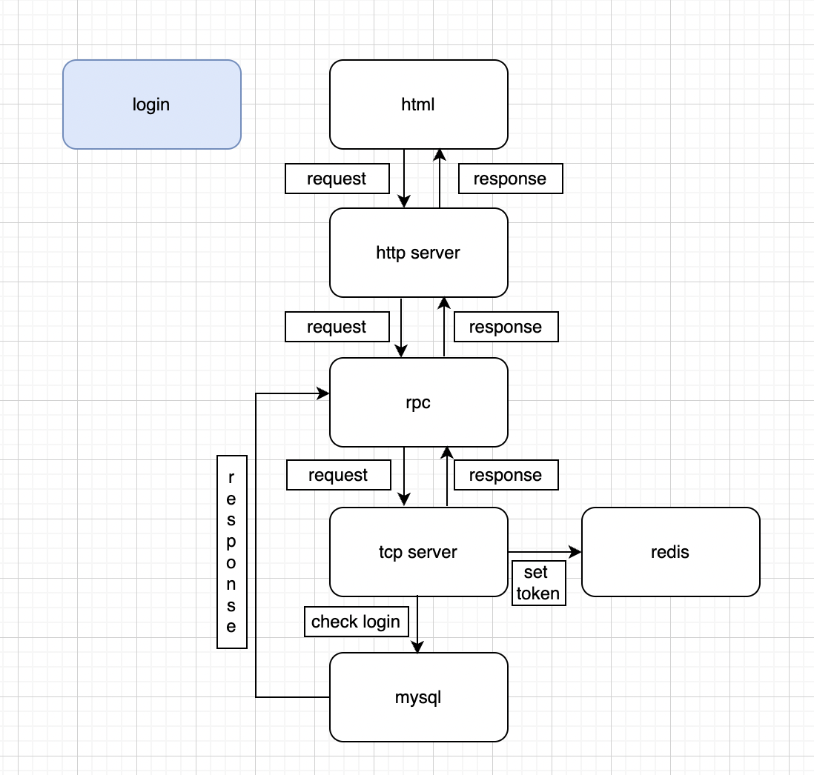

**获取用户昵称流程图**

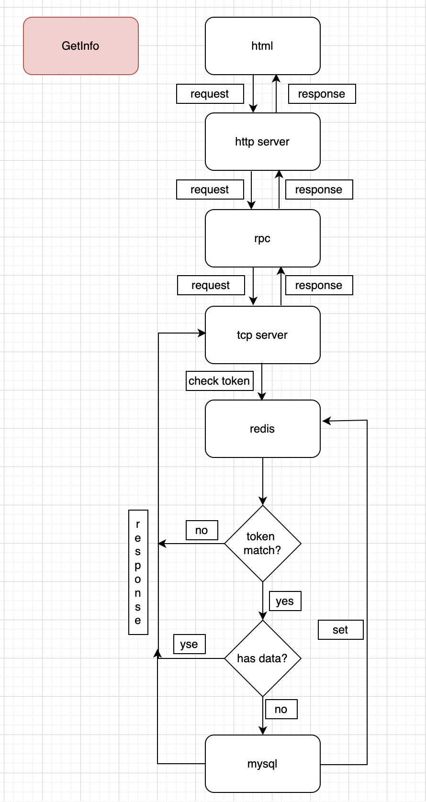

**更改昵称/上传图片流程图**

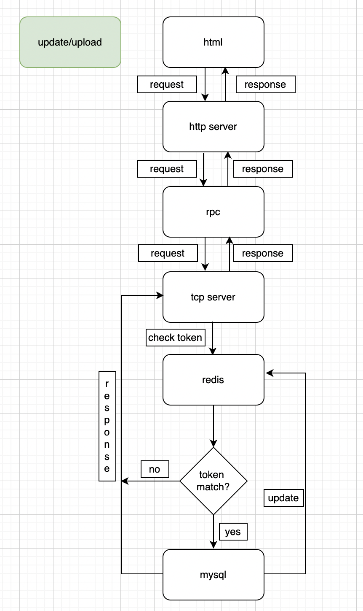


## API

### 1.登陆接口

| URL                         | 方法 |
|-----------------------------| ---- |
| http://localhost:1806/Login | POST |

**输入参数**

| 参数名   | 描述   | 可选 |
| -------- | ------ | ---- |
| username | 用户名 | 否   |
| password | 密码   | 否   |

### 2.获取用户信息接口

| URL                           | 方法  |
|-------------------------------|-----|
| http://localhost:1806/GetInfo | GET |

**输入参数**

| 参数名   | 描述   | 可选 |
| -------- | ------ | ---- |
| username | 用户名 | 否   |

### 3.更改昵称接口

| URL                                  | 方法   |
|--------------------------------------|------|
| http://localhost:1806/UpdateNickName | POST |

**输入参数**

| 参数名      | 描述  | 可选 |
|----------|-----| ----- |
| username | 用户名 | 否  |
| nickname | 昵称  | 否   |

### 4.上传图片接口

| URL                             | 方法   |
|---------------------------------|------|
| http://localhost:1806/UploadPic | POST |

**输入参数**

| 参数名      | 描述  | 可选 |
|----------|-----| ---- |
| username | 用户名 | 否   |
| image    | 图像  | 否   |

### 5.添加用户接口

| URL                           | 方法   |
|-------------------------------|------|
| http://localhost:1806/AddUser | POST |

**输入参数**

| 参数名    | 描述  | 可选  |
|----------|-----|-----|
| username | 用户名 | 否   |
| password | 密码  | 否   |
| nickname | 昵称  | 是   |

### 6.登出接口

| URL                          | 方法   |
|------------------------------|------|
| http://localhost:1806/Logout | POST |

**输入参数**

| 参数名   | 描述   | 可选 |
| -------- | ------ | ---- |
| username | 用户名 | 否   |

### redis设计

用以缓存登陆token和用户信息，均以哈希表的形式保存

**token**

| key           | value                                          |
| ------------- | ---------------------------------------------- |
| auto_username | Token                                          |

**用户信息**

| key           | value                                                   |
| ------------- |---------------------------------------------------------|
| username      | { [valid, "1"/""],[nick_name,“”] [profile_picture,“”] } |

> valid用以验证数据有效，当更改nickname或者profile_picture时，设置为无效

### mysql设计

维护一张表users，存放用户的信息

| Field           | Field        | Null | Key  | Default | Extra          |
|-----------------| ------------ |------| ---- | ------- | -------------- |
| id              | bigint       | NO   | PRI  | NULL    | auto_increment |
| user_name       | varchar(255) | NO   | UNI  |         |                |
| pass_word       | varchar(255) | NO   |      |         |                |
| nick_name       | varchar(255) | YES  |      |         |                |
| profile_picture | varchar(255) | YES  |      |         |                |

## 代码结构

```bash
GoUserManaSys
├── benchmark               //压测脚本
├── config                  //配置文件
├── log                     //日志相关文件
├── dao                      //mysql和redis
├── httpserver              //http server
├── httpservertest          //http server test,采用固定token
├── rpc                     //rpc实现
├── static                  //用户图片保存路径及readme.md图片资源路径
├── statictest              //测试上传图片保存路径
├── tcpServer               //tcp_server.log server
├── web                     //前端界面
├── utils                   //辅助函数和公用数据协议
└── README.MD               //项目文档
```
## 部署

1. 在conig/config.ini下配置系统资源、端口号、redis、mysql、静态资源路径等
2. 运行TCP server

```bash
cd tcpserver
go vet
go build tcp_server.go
./tcpServer
```
3.运行HTTP server

```bash
cd httpserver
go vet
go build http_server.go
./tcpServer
```
>压测时运行测试版HTTP server

```bash
cd httpservertest
go vet
go build http_servertest.go
./tcpServer
```

##功能测试

**登陆**

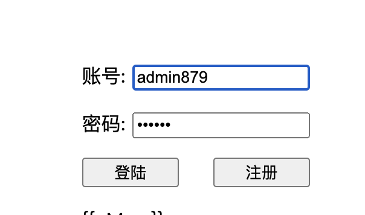

**获取用户信息**


**更新昵称**


**上传图像**


**注册**

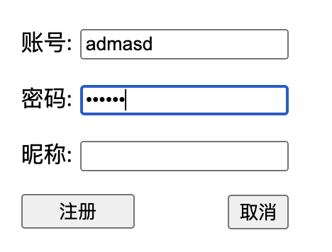

**登出**

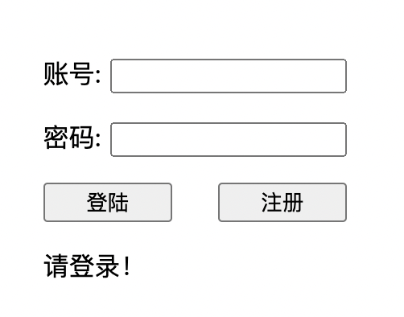

## 压测

需要将tcp_server的token选为GetTestToken.
使用wrk配合lua脚本进行压测，详细见benchmark目录下。在终端运行wrk指令即可进行压测。

eg：开启2个线程，保持200个http连接对http://localhost:1806/Login接口进行30s的压测
> wrk -d30s -c200 -t2 -s ./benchmark/login_test.lua http://localhost:1806/Login

### 压测结果：
### login:

#### 固定用户 200 并发

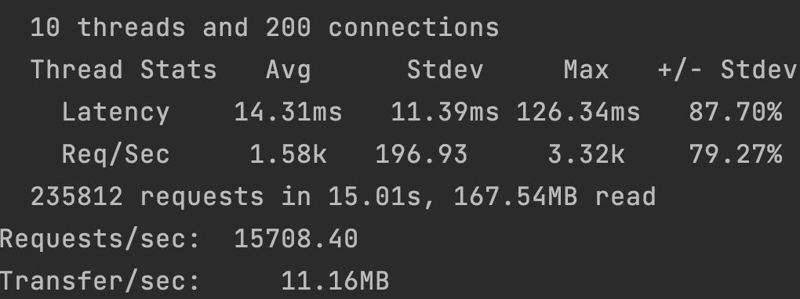  

#### 随机用户 200 并发

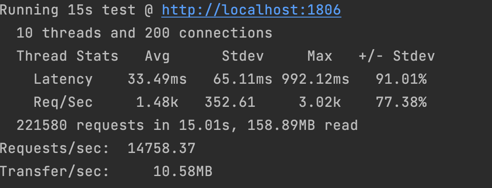

#### 固定用户 2000 并发

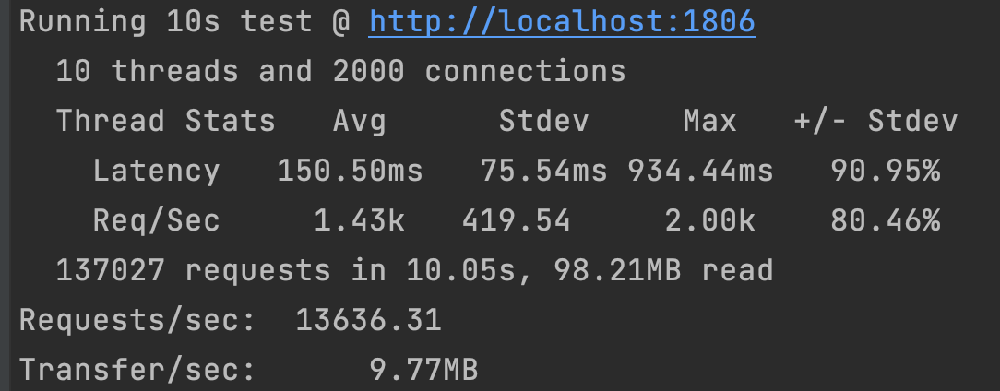

#### 随机用户 2000 并发

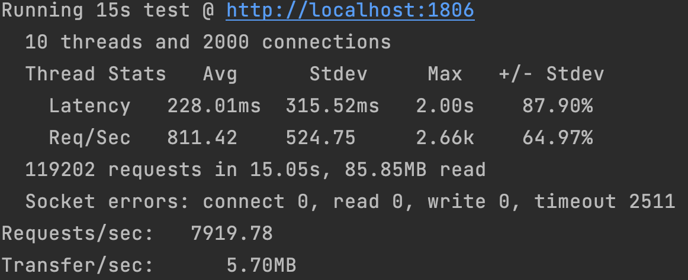

### getInfo:

#### 固定用户 200 并发

> 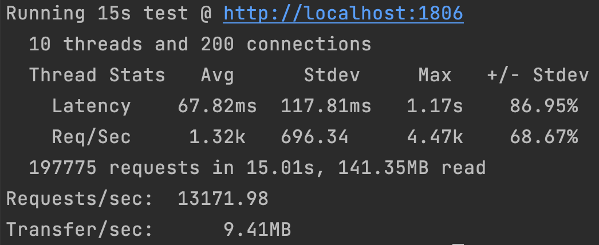

#### 随机用户 200 并发

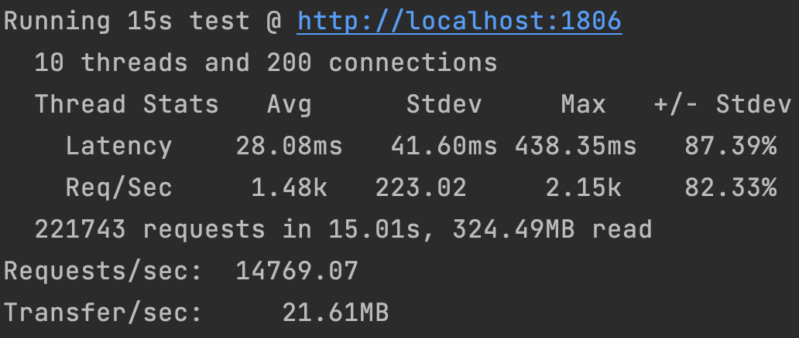

#### 固定用户 2000 并发

>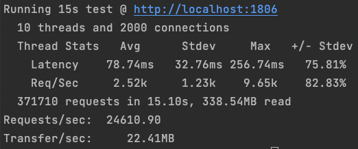

#### 随机用户 2000 并发

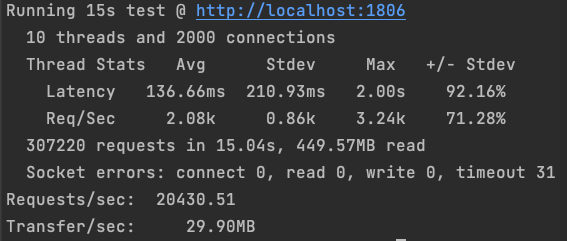

### _updateNickName:

#### 固定用户 200 并发

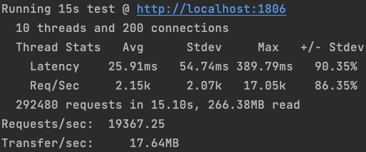

#### 随机用户 200 并发

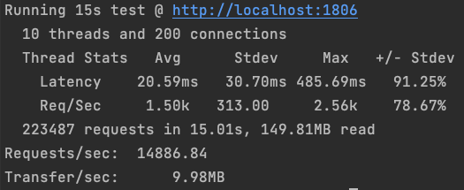

#### 固定用户 2000 并发

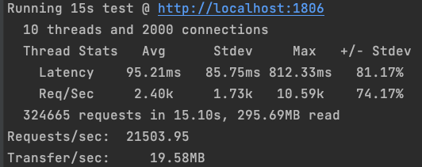

#### 随机用户 2000 并发

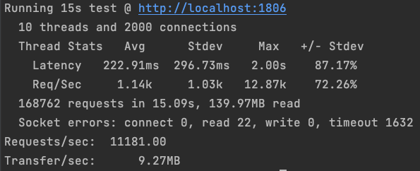

### _uploadPic:

#### 随机用户 200 并发

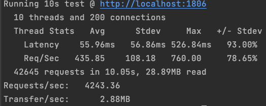

#### 随机用户 2000 并发

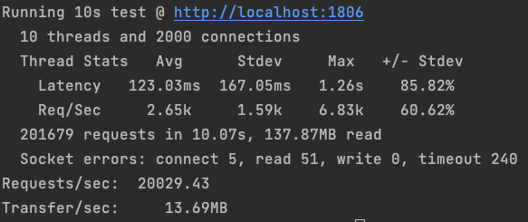

## 相关配置

mac上进行高并发测试时会遇到性能问题，需要进行一些设置

### 系统端

1. kern.ipc.somaxconn：表示内核最多并发连接数，会限制接收新 TCP 连接侦听队列的大小。默认为128，推荐在1024-4096之间，数字越大占用内存也越大。

   ```bash
   sudo sysctl -w kern.ipc.somaxconn=2048
   ```

2. kern.maxfiles：系统中允许的最多文件数量（根据需要灵活配置）

   ```bash
   sudo sysctl -w kern.maxfiles=22288 
   ```

## mysql端

1. mysql允许的最大连接数：max_connections，默认是150。

通过以下sql语句查看max_connections值。

```sql
show variables like "max_connections";
```

通过一下sql语句可以设置（根据需要灵活配置）

```sql
set global max_connections = 3000;
```

当遇到连接数超过max_connections时候，会报类似如下错误：

```
err:"Error 1040: Too many connections"
```
其他配置见系统配置文件 ./config/config.ini


## 目前存在的问题

当2000个随机用户进行压测时，会报以下错误：

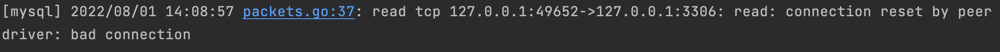

压测时的timeout猜测也是由该错误引起。目前尚未解决该错误，还在继续排查。